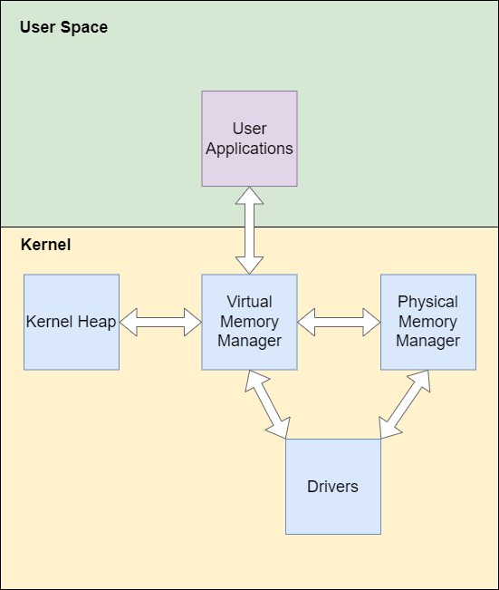

# Physical Memory Manager Design

This document is meant to cover the design of the physical memory management capabilities in the
microkernel, how it differs from that of a monolithic kernel and what challenges and opportunities
are presented as a consequence.

In a classic monolithic kernel the management of physical memory is contained purely within the
kernel itself. User applications and the kernel heap would both request memory from the virtual
memory manager (VMM) which itself would call out to the physical memory manager (PMM). Certain
drivers will require contiguous runs of physical memory or memory within certain ranges (or both).
These would need special handling where those drivers will have access to both components or the
VMM will define an interface which exposes the necessary functionality.

Subsequenly memory management in a monolithic kernel may look as follows

  
_Monolithic kernel memory management_

In a microkernel the PMM is expected to sit within userspace. Drivers also sit within userspace so
would request any specific physical memory requirements (address range, continuous, etc) from the
userspace PMM. Within the microkernel the PMM is reduced to a physical frame allocator (PFA).

Memory management in a microkernel would now look like this

  
_Microkernel kernel memory management_

Here the microkernel allocator is solely a single frame allocator used to provision the kernel heap
and the VMM as required. It makes no guarantees about the location or contiguity of the frames it
provisions. The only guarantees it needs to make are with regards to safe concurrent access and
performance.

## Assumptions

With regards to memory mapped IO and non-volatile memory these will not be managed by the PMM at
all. Any process wishing to access as such will require the capability to be issued to them and
then make a kernel request to map that capability into their address space.

Larger frame allocation is not something the kernel will ever need. A 2MB or 1GB frame might be
provisioned by userspace in future but the kernel will only need to deal with virtual mapping of
such a frame and will not need to allocate one itself.

Until we have a driver that requires physical memory in a particular address space we are going to
treat both kernel and userspace managed frames as commodities.

When we are forced to treat physical memory as a non-commodity the following cascade of assumptions
is made:

1. With device drivers banished to userspace the kernel does not care about location or contiguity
of the frames of physical memory it uses.
2. If it does care about location or contiguity of frames it will be able to rely upon the
userspace PMM to allocate them as required
3. If calling out to the PMM is too slow it will be able to be served by having an appropriate
in kernel module that acts as a mere container that delegates the real work to the PMM. With the
only aim being to have appropriate memory hot loaded so that the kernel can avoid allocating
physical memory via IPC.
4. If it turns out the kernel needs very specific memory prior to the PMM becoming available, the
module from 3 can be preloaded with appropriate memory before the PMM is brought up

That is we will implement this type of allocation solely within userspace initially. The only
non-userspace changes to be made initially when implementing this will be altering the bootloader
and kernel initialisation to avoid using specific ranges of the address space as much as possible.

## Kernel Physical Frame Allocator

### Non-Functional Requirements

#### NFR1 - It must be thread safe

This is intended to be a multi-processor OS so the allocator must never:
- Become corrupted due to access from multiple threads
- Allocate the same frame out to multiple concurrent requests
- Lose a freed frame because two were freed simultaneously. While this won't break the system
it does constitute a memory leak that will reduce the stability of the system. This is unacceptable
in the kernel.

#### NFR2 - It must provision frames in O(1)

This system is going to be provisioning frames for the VMM and other critical kernel functions. It
cannot be sat there taking an eternity to decide which frame to allocate.

#### NFR3 - It must rarely call out to the PMM during an allocation

It is impossible to guarantee that the PFA will never call out to the PMM during an allocation.
However this should be minimised as much as possible.

### Design

The simplest design for a frame allocator is as a [ring buffer](https://en.wikipedia.org/wiki/Circular_buffer).
This can be implemented in Rust as the following

```rust
pub struct FrameAllocator {
    buffer: *mut PhysicalAddress,
    buffer_size: usize
    read_pos: AtomicU16,
    write_pos: u16,
    write_lock: Lock,
}
```

Here the basic algorithm for allocate is as follows

```
loop {
    while buffer empty
        call_out_to_pmm
    Read the PhysicalAddress at read_pos
    Calculate the new read_pos as new_read_pos
    Compare and swap read_pos and new_read_pos
    If successful return the physical address
}
```

Only one competing thread will successfully compare and swap (CAS) the read_pos so that one claims the
frame. The other retries after it fails and attempts to get the next one. Note some kind of lock
is going to have to be added for the code to handle the call out to the PMM. We don't want 32
separate CPUs each simultaneously demanding 1024 frames of memory from the PMM. It should be made
part of the code calling out rather than part of this algorithm though as this code will be called
from outside an alloc invocation

The basic algorithm for free is

```
loop {
    if !space in buffer
        return full buffer error //This frame needs to go back to the PMM
    if try_acquire(write_lock) {
        if !space in buffer //Check this again in case something was freed since lock was acquired
            return full buffer error //This frame needs to go back to the PMM
        Insert address at write_pos
        Increment write_pos
        release(write_lock) //ideally this is a RAII lock guard in the if condition.
    }
}
```

Excess freed frames will be stored in a buffer awaiting an IPC to send them back to PMM in bulk

A hard lock is being used here as every scenario I could think of leads to potentially invalid
state. There are two faulty alternatives using an atomic write_pos

---
#### **Insert address first**
In this algorithm we are just setting the address in the buffer and then doing a CAS on the
write_pos. This doesn't work because another free may have overwritten the address while we
are doing the CAS.

We could now set the address a second time to be sure. This won't break the other free as it will
have failed its CAS and will now be trying to set the following space. However it is possible for
the incorrect frame to be allocated while we are fixing this. There are two consequences to this
bug:
- The frame from the second free will be allocated out twice
- The frame from the first free will leak forever

#### **Update write_pos first**
In this algorithm we are setting the write_pos forward first before setting the address in the
buffer. This keeps any subsequent free out of altering the buffer incorrectly but it has the same
bug where the existing frame might get allocated out before the address is updated.

This bug leads to the following consequences:
- The frame left over in the buffer from a previous allocation will be allocated twice
- The frame from the free will leak
---

As a consequence of the above we're going to need to use a hard lock. Alternative we could maintain
a second write_pos which is controlled atomically where the free algorithm only operates when the
two write_pos are the same. However this is just a lock with extra steps. The performance of a two
write_pos system relative to write_pos + lock needs to be investigated.

It is worth noting that despite the extra concurrency overhead on the free the allocate still keeps
running with O(1) performance provided it doesn't run out of frames.

The code to refill the buffer will need to be run periodically whenever the scheduler returns
control to the kernel. This code will also handle sending any excess freed frames back to the PMM.

#### **Buffer Size**

One of the issues that needs to be considered is how big the ring buffer should be. The obvious
statement is some multiple N of a 4kb page size, enabling us to store 512*N 8-byte addresses. The
correct size won't be found without some profiling but it should be enough to satisfy **NFR3**.

## PMM (Kernel Facing)

The PMM on kernel side will be provided by a set of function pointers. Intially these will point to
a temporary spinlock protected bitmap allocator in kernel space. Once the user space PMM is running
these function pointers will instead point to functions that call the PMM via IPC. All memory will
be released from the temporary allocator once the PMM is confirmed as up and the switch has
completed successfully.

## PMM

This will interact with the kernel and drivers via IPC. The primary mode of bulk allocation of
frames will be by using a _grant_ style IPC call. A full frame of addresses to allocate or free
will be put together with the count stored within the IPC registers. This will enable the kernel
to claim hundreds of frames at once if it needs to fill the ring buffer quickly.